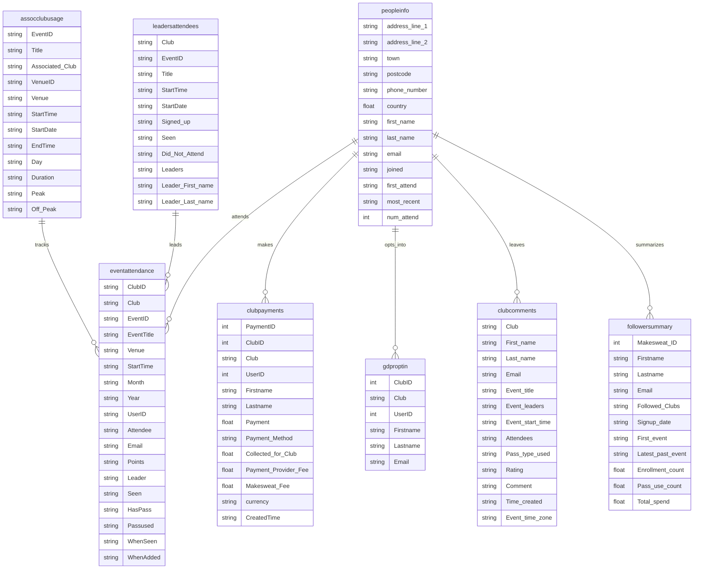

# Rabble Sports Analytics Pipeline

## Data Pipeline Implementation

## Initial Thoughts

After looking at the booking platform, I understood that the data was available in the following 8 files. There were downloaded in csv for ease of transmitting to other data systems. The files were:

1. peopleinfo.csv - Core player database
    - Contains basic personal information about players
    - Includes contact details, address information, and attendance statistics
    - Acts as the central player registry with joining dates and activity records

2. eventattendance.csv - Detailed event participation records
    - Tracks who attended which events
    - Records venue, timing, and whether passes were used
    - Links players to specific events and tracks their attendance status

3. clubpayments.csv - Financial transaction records
    - Records all payments made by players
    - Includes fee breakdowns between club, payment provider, and platform
    - Tracks payment methods and timestamps

4. leadersattendees.csv - Event leadership and attendance tracking
    - Links events to their leaders
    - Tracks sign-ups, attendance, and no-shows
    - Records leader information for each event

5. assocclubusage.csv - Venue and timing records
    - Tracks facility usage and event scheduling
    - Records peak vs off-peak usage
    - Contains venue-specific information and event durations

6. clubcomments.csv - Player feedback and ratings
    - Stores event feedback and ratings from players
    - Includes comments tied to specific events and leaders
    - Records when feedback was provided

7. gdproptin.csv - Marketing consent records
    - Tracks marketing preferences and consent
    - Links players to their communication preferences
    - GDPR compliance related data

8. followersummary.csv - Player engagement metrics
    - Aggregates player activity and engagement
    - Tracks total spend and participation
    - Records which clubs players follow

### Entity Relationship Diagram

(also available to view [here](../images/bookingplatform_erd.png))

After extracting the data, the data will need transforming into a more logical data structure.

### MakeSweat API integration

### Automated data extraction
### GCP storage configuration