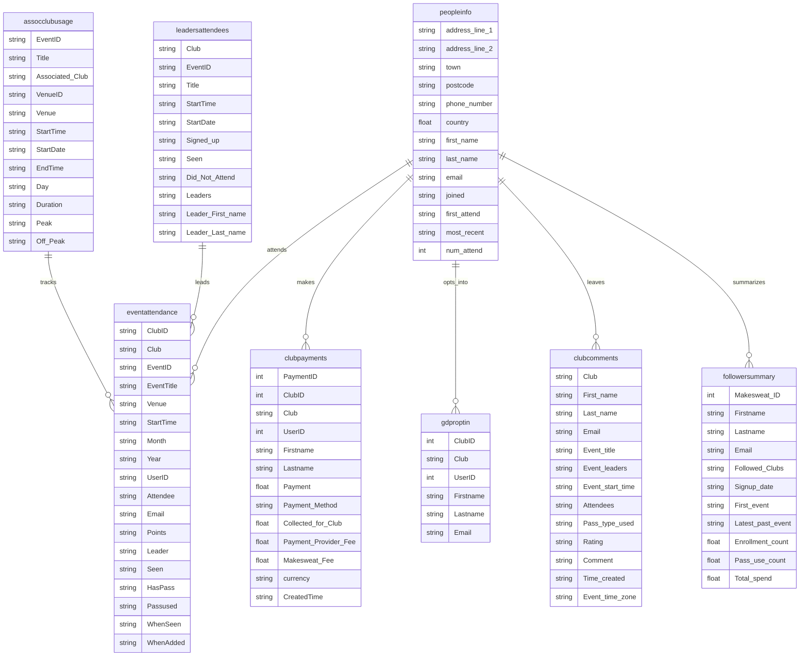

# Rabble Sports Analytics Pipeline

## 01: MakeSweat Data Pipeline Implementation

## Overview
This document outlines the implementation of an automated data pipeline that extracts data from MakeSweat's API and loads it into Google BigQuery. The pipeline handles both regular incremental updates and historical data loads for multiple clubs.

## Initial Thoughts

After looking at the booking platform, I understood that the data was available in the following 8 files. There were downloaded in csv for ease of transmitting to other data systems. The files were:

1. peopleinfo.csv - Core player database
    - Contains basic personal information about players
    - Includes contact details, address information, and attendance statistics
    - Acts as the central player registry with joining dates and activity records

2. eventattendance.csv - Detailed event participation records
    - Tracks who attended which events
    - Records venue, timing, and whether passes were used
    - Links players to specific events and tracks their attendance status

3. clubpayments.csv - Financial transaction records
    - Records all payments made by players
    - Includes fee breakdowns between club, payment provider, and platform
    - Tracks payment methods and timestamps

4. leadersattendees.csv - Event leadership and attendance tracking
    - Links events to their leaders
    - Tracks sign-ups, attendance, and no-shows
    - Records leader information for each event

5. assocclubusage.csv - Venue and timing records
    - Tracks facility usage and event scheduling
    - Records peak vs off-peak usage
    - Contains venue-specific information and event durations

6. clubcomments.csv - Player feedback and ratings
    - Stores event feedback and ratings from players
    - Includes comments tied to specific events and leaders
    - Records when feedback was provided

7. gdproptin.csv - Marketing consent records
    - Tracks marketing preferences and consent
    - Links players to their communication preferences
    - GDPR compliance related data

8. followersummary.csv - Player engagement metrics
    - Aggregates player activity and engagement
    - Tracks total spend and participation
    - Records which clubs players follow

### Entity Relationship Diagram

(also available to view [here](../images/bookingplatform_erd.png))

After extracting the data, the data will need transforming into a more logical data structure.

## Components

### 1. Data Extraction Script
The main Python script ([`makesweat_pipeline.py`](../scripts/makesweat_pipeline.py)) handles:
- Secure authentication with MakeSweat API
- Data extraction for multiple report types
- Direct streaming to Google Cloud Storage
- Error handling and logging
- Support for both incremental and historical data loads

Key features:
- No local storage of sensitive data
- Secure credential management through Google Secret Manager
- Support for multiple clubs (225, 227)
- Handles 8 different report types:
  - Event attendance
  - Club payments
  - Leaders/attendees
  - Associated club usage
  - Club comments
  - People info
  - GDPR opt-in
  - Followers summary

To run, the following commands can be executed:
```bash
python /Users/anna/Documents/GitHub/Portfolio/projects/Rabble/scripts/makesweat_pipeline.py
python /Users/anna/Documents/GitHub/Portfolio/projects/Rabble/scripts/makesweat_pipeline.py --historical
```
### 2. Data Storage
The pipeline uses two main storage locations in Google Cloud Storage:
- `/data/` - for regular incremental updates
- `/backup/` - for historical data loads

[This script](../scripts/create_transfers.sh) set up the data transfers between the buckets and datasets.

It was made executable with ```bash chmod +x create_transfers.sh``` and executed with ```bash ./create_transfers.sh```.

The transfers run on two different schedules:
1. Incremental Updates:
```bash
45 9 * * 1,5  # Runs at 9:45 AM on Mondays and Fridays
```

2. Historical Loads:
```bash
45 9 1 1,4,7,10 *  # Runs at 9:45 AM on the 1st of January, April, July, and October
```

**Date Transfer Settings:**
Mixed data types including:
- Floats (payments, attendance counts)
- Dates (various formats)
- Strings (including possible nulls/empty fields)
- Integers (IDs)

Some fields that might need special handling:
- Comments (might contain commas)
- Addresses (might contain commas, line breaks)
- Names (might contain special characters)
- allow_jagged_rows: true 
- max_bad_records: 10 
- allow_quoted_newlines: true (for comments and addresses)
- skip_leading_rows: 1 (for headers)
- null_marker: "" (empty strings treated as NULL)
- encoding: "UTF-8" (matches your files)

### 3. BigQuery Integration
Data is loaded into two separate BigQuery datasets:
- `RabbleIngest` - for current/incremental data
- `RabbleIngest_Historical` - for historical data backups

Separating historical and current data into different datasets makes a lot of sense for:
- Better data organization
- Easier access control management
- Clearer data lineage
- Different refresh schedules

### 4. Security Implementation
- Credentials stored in Google Secret Manager
- Service account authentication for Google Cloud services
- Environment variables for secure configuration
- No hardcoded credentials in code
- Compliant with data protection requirements

## Automation

### Scheduled Execution
The pipeline runs on two different schedules:

1. Incremental Updates:
```bash
0 9 * * 1,5  # Runs at 9:00 AM on Mondays and Fridays
```

2. Historical Loads:
```bash
0 9 1 1,4,7,10 *  # Runs at 9:00 AM on the 1st of January, April, July, and October
```

### Manual Trigger Scripts
Two scripts are available for manual execution:
1. `trigger_weekly_transfers.sh` - Triggers all current data transfers
It was made executable with ```bash chmod +x trigger_weekly_transfers.sh``` and executed with ```bash ./trigger_weekly_transfers.sh```.
2. `trigger_historical_transfers.sh` - Triggers all historical data transfers
It was made executable with ```bash chmod +x trigger_historical_transfers.sh``` and executed with ```bash ./trigger_historical_transfers.sh```.

The scripts will:
- Find all relevant transfer configurations
- Trigger each one individually
- Add a small delay between triggers to avoid rate limits
- Show progress as they run

## File Structure
```
/Users/anna/Documents/GitHub/Portfolio/projects/Rabble/scripts/
├── makesweat_pipeline.py
├── trigger_weekly_transfers.sh
├── trigger_historical_transfers.sh
├── cron_weekly.log
└── cron_historical.log
```

## Environment Setup

### Required Environment Variables
```bash
GCS_BUCKET_NAME="europe-west2-rabble-5e308dc8-bucket"
GOOGLE_CLOUD_PROJECT="rabble-424818"
GOOGLE_APPLICATION_CREDENTIALS="/path/to/service-account.json"
```

### Google Cloud Secrets
The following secrets are managed in Google Secret Manager:
- `makesweat_club_ids`
- `makesweat_credentials`
- `makesweat_report_names`
- `makesweat_userident`

## Error Handling
- Comprehensive logging implementation
- Maximum of 10 bad records allowed per transfer
- Automatic retry mechanisms
- Error logs stored in dedicated log files

## Data Quality Controls
- Header validation
- Data type checking
- Empty field handling
- UTF-8 encoding enforcement
- Jagged row allowance
- CSV parsing with proper quoting and delimiter handling

## Maintenance and Monitoring
- Log files for both weekly and historical runs
- BigQuery transfer monitoring
- Error notification system through logging
- Manual trigger capability for ad-hoc runs

## Future Improvements
Potential areas for enhancement:
1. Implement automated data quality checks
2. Add alerting for failed transfers
3. Create monitoring dashboard
4. Implement data validation rules
5. Add data lineage tracking

## Testing Procedure
For testing new changes:
1. Use manual trigger scripts
2. Check logs for errors
3. Verify data in BigQuery
4. Confirm data quality
5. Validate scheduled runs

## Support and Troubleshooting
Common troubleshooting steps:
1. Check log files for errors
2. Verify environment variables
3. Confirm Google Cloud permissions
4. Validate secret access
5. Check BigQuery transfer status
