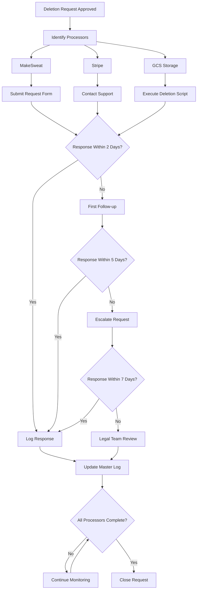

# Rabble Sports Analytics Pipeline

### 04: Data Governance and GDPR Implementation

## Project Overview
This project implements comprehensive data governance and GDPR compliance for a UK-based sports organization. The implementation covers automated data collection, secure storage, and compliant data subject request handling. The company policy can be viewed [here](../documentation/Data_Governance_Policy.md).

### Technical Stack
- **Data Collection**: MakeSweat Platform
- **Data Processing**: Apache Airflow
- **Storage**: Google Cloud Storage
- **Payment Processing**: Stripe
- **Languages**: Python, SQL
- **Infrastructure**: Google Cloud Platform

### Key Components

#### 1. Automated Data Pipeline
```python
# Cloud Composer DAG for automated data collection
from airflow import DAG
from airflow.operators.python import PythonOperator

def get_date_range(**context):
    """Get the date range for data pull"""
    today = datetime.now()
    seven_days_ago = today - timedelta(days=7)
    return {
        'start_date': seven_days_ago.strftime('%Y-%m-%d'),
        'end_date': today.strftime('%Y-%m-%d')
    }
```

#### 2. Data Types Managed
- Personal identification information
- Event attendance records
- Payment information
- Leadership records
- Club usage statistics
- Member feedback
- Marketing preferences
- Membership passes

#### 3. GDPR Compliance Implementation

##### Data Subject Rights Handling
1. **Subject Access Requests (SAR)**
   - Complete data inventory
   - Automated data compilation
   - Secure delivery process

2. **Right to Erasure**
   - Anonymization process
   - Legal retention management
   - Third-party coordination

#### 4. Third-Party Integration

##### MakeSweat Integration
- Automated data extraction
- Secure API communication
- Data minimization practices

##### Stripe Integration
- Compliant payment processing
- Data retention management
- Secure data handling

#### 5. Security Measures

##### Infrastructure Security
- Cloud-native security controls
- Encryption at rest and in transit
- Access control management

##### Data Protection
- Regular backups
- Disaster recovery
- Audit logging

### Implementation Highlights

#### 1. Automated Data Collection
```python
def download_and_upload_report(report_name, **context):
    """Download report from MakeSweat and upload to GCS"""
    dates = context['task_instance'].xcom_pull(task_ids='get_dates')
    # Sample of script
```

The script in full can be found [here](../scripts/makesweat_pipeline.py).

#### 2. Data Anonymization
```sql
-- Here is a sample of an anonymization query
UPDATE users
SET 
    first_name = 'User',
    last_name = 'Removed',
    email = NULL,
    phone = NULL
WHERE user_id = ?;
```
The script in full can be found [here](../scripts/Data%20anonymization.sql).

#### 3. Request Tracking System
```csv
Request ID,Date Received,Request Type,Subject Name,Subject ID,Status,Due Date
DSAR-2024-001,2024-01-20,Access,John Doe,12345,In Progress,2024-02-19
```

### Process Documentation

#### 1. Data Subject Request Handling
1. Request Receipt
2. Identity Verification
3. Data Compilation/Deletion
4. Quality Check
5. Response Delivery

```mermaid
flowchart TD
    A[Request Received] --> B{Request Type?}
    
    B -->|Access Request| C[Verify Identity]
    B -->|Deletion Request| D[Verify Identity]
    
    C --> E{Identity Verified?}
    D --> F{Identity Verified?}
    
    E -->|No| G[Request Additional Verification]
    F -->|No| G
    G --> E
    
    E -->|Yes| H[Search All Systems]
    F -->|Yes| I[Check Legal Requirements]
    
    H --> J[Compile Data Package]
    I --> K{Legal Hold?}
    
    K -->|Yes| L[Document Retention Requirements]
    K -->|No| M[Initiate Deletion Process]
    
    L --> N[Partial Deletion]
    M --> O[Full Deletion Process]
    
    N & O --> P[Contact Data Processors]
    
    P --> Q{Processor Confirmation?}
    Q -->|No| R[Follow Up - 5 Days]
    Q -->|Yes| S[Document Response]
    R --> Q
    
    S --> T[Update Request Log]
    
    J --> U[Quality Check]
    U --> V[Deliver to Subject]
    
    T & V --> W
    [Close Request]
```

#### 2. Data Retention Schedule
| Data Type | Retention Period | Basis |
|-----------|------------------|-------|
| Payment Records | 7 years | Legal Requirement |
| Attendance | 3 years | Business Purpose |
| Marketing | Until Withdrawn | Consent |

#### 3. Third-Party Management


### Security Implementation

#### 1. Authentication
- Multi-factor authentication
- Role-based access control
- Regular access reviews

#### 2. Data Protection
- AES-256 encryption
- TLS 1.3 for transit
- Secure key management

### Monitoring and Compliance

#### 1. Audit Trails
- Request tracking
- Processing logs
- Access logs

#### 2. Regular Reviews
- Monthly compliance checks
- Quarterly policy reviews
- Annual security assessments

### Results and Benefits
1. Automated data handling
2. GDPR compliance
3. Secure data management
4. Efficient request processing
5. Documented procedures

### Future Enhancements
1. Enhanced automation
2. Advanced analytics
3. Real-time monitoring
4. Automated compliance checks

---

*Note: This documentation represents a real-world implementation of GDPR compliance and data governance for a UK sports organization. All sensitive information has been removed or anonymized.*