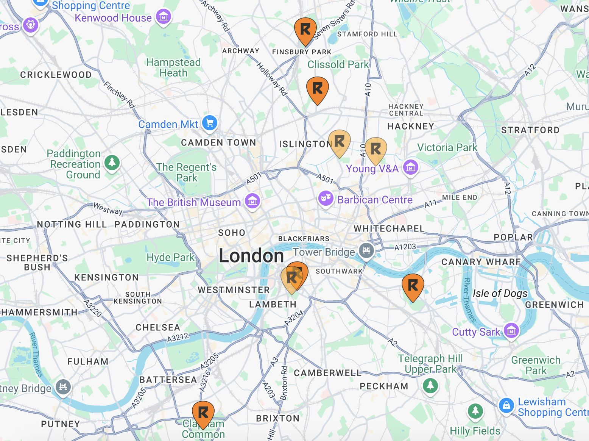
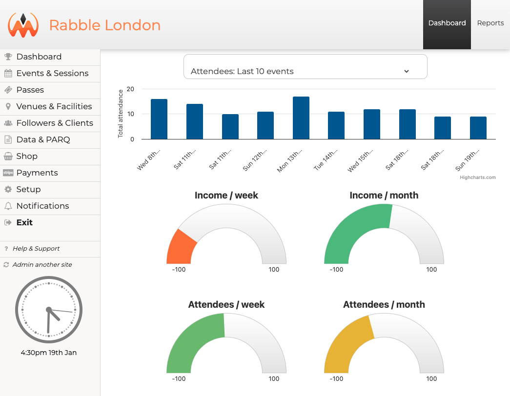

# Rabble Sports Analytics Pipeline

## About Rabble 

Rabble is an innovative sports organization that transforms traditional fitness into engaging, game-based activities. Founded with the mission to make exercise fun and accessible, Rabble runs sessions across multiple London locations, combining high-intensity interval training (HIIT) with team games and social interaction. The organization has grown significantly, managing multiple venues, instructors and thousands of member activities monthly, and has spawned franchises across the UK.

I started going to Rabble sessions over seven years ago and found the sessions so encouraging and enthusiastic. After years of being I couldn't do sport in school PE lessons, Rabble provided an environment where I could exercise and have fun, and have me enough self-belief to start running too. One of its core tenets is the social aspect and I quickly found friends through their socials, friends I am still with today. During the pandemic, Rabble managed to keep going but its founder stepped away to start new projects. Dave and Maria were players and session leaders and bought Rabble to carry on with its mission. 

A year on, they wanted to look at the data that was building up in booking system but they didn't know how to process it. The booking system adequately manages the booking and payment system, but it is lacking features for on data management and analytics.

My project is to extract both data and insights from the booking platform into the usable insights to help Rabble sustainably grow. This project on gitHub is to showcase the work I am doing, and will always be considered a work in progress. Rabble functions not only as a business but as a community. While I speak about the necessary KPI's and revenue streams, imy language will reflect the humanity of Rabble and how it seeks to understand its players: not to drive profit but to include them in a community.

## Project Overview
This project implements an automated data pipeline and analytics platform for Rabble London, focusing on member engagement analysis, retention optimization, and GDPR-compliant data management. The system processes daily activity data from multiple sources, transforms it for analysis, and provides actionable insights through interactive dashboards.

### Aims
1. **Player Engagement Optimization**
   - Track and analyze player participation patterns
   - Identify factors contributing to player retention
   - Enable data-driven decision making for seasonal session planning

2. **Operational Efficiency**
   - Automate data collection and processing
   - Streamline reporting procedures
   - Improve session capacity planning

3. **Revenue Tracking**
   - Track and analyse revenue streams
   - Consider pricing strategies based on engagement and competition
   - Maximise lifetime player value

4. **GDPR Compliance**
   - Ensure data protection
   - Implement proper data retention policies
   - Enable efficient response to data subject requests

### Key Performance Indicators (KPIs)

#### Member Engagement KPIs
1. **Active Player Metrics**
   - Monthly Active Player (MAU)
   - Weekly Active Player (WAU)
   - Year-over-Year Growth Rate
   - New Player Acquisition Rate

2. **Retention Metrics**
   - Overall Retention Rate
   - Cohort-based Retention Analysis
   - Average Player Lifetime
   - Churn Rate by Location

3. **Session Performance**
   - Average Sessions per Player
   - Session Utilization Rate
   - Popular Session Times
   - Location Performance Comparison

#### Financial KPIs
1. **Revenue Metrics**
   - Monthly Recurring Revenue (MRR)
   - Average Revenue per Player
   - Lifetime Value (LTV)
   - Revenue by Pass Type

2. **Growth Metrics**
   - Year-over-Year Revenue Growth
   - New Player Revenue
   - Location Revenue Comparison
   - Pass Type Revenue Distribution

#### Operational KPIs
1. **Session Management**
   - Session Capacity Utilization
   - Instructor Performance
   - Location Efficiency
   - Peak Time Analysis

2. **Player Journey**
   - First Session to Second Session Conversion
   - Pass Type Progression
   - Member Activity Patterns
   - Cross-Location Usage

#### Data Requirements
1. **Player Data**
   - Contact Details
   - Membership History
   - Payment Records

2. **Session Data**
   - Attendance Records
   - Session Types
   - Location Information
   - Instructor Details

3. **Financial Data**
   - Transaction Records
   - Pass Usage
   - Payment Methods

#### Reporting Requirements
1. **Regular Reports**
   - Daily Attendance Summary
   - Weekly Revenue Report
   - Monthly Retention Analysis
   - Quarterly Performance Review

2. **Ad-hoc Analysis**
   - Custom Date Range Reports
   - Specific Location Analysis
   - Campaign Performance Tracking

#### Success Criteria
1. Automated daily data processing
2. 99.9% data pipeline reliability
3. GDPR compliance verification
4. Interactive dashboard implementation
5. Reduced manual reporting time by 80%
6. Improved decision-making capability for operations team

### Key Features
- Automated twice-weekly data extraction from MakeSweat platform
- GDPR-compliant data processing and storage
- Member engagement and retention analytics
- Financial performance tracking
- Venue performance comparison
- Custom reporting system

## Technical Architecture

*To come: system architecture diagram*

### Technology Stack
- Python (Data Processing)
- Google Cloud Platform
  - Cloud Storage
  - BigQuery
  - Looker
- SQL
- Data Visualization Tools

## Database Schema

*To come: an Entity Relationship Diagram showing key tables and relationships*

## Project Documentation
Detailed documentation of my process is available in the following notebooks:

1. [Data Pipeline Implementation](./docs/01_data_pipeline.md)
   - MakeSweat API integration
   - Automated data extraction
   - GCP storage configuration

2. [Data Cleaning and Processing](./docs/02_data_cleaning.md)
   - Data validation rules
   - Transformation logic
   - Quality assurance processes

3. [Analytics Dashboard Development](./docs/03_dashboards.md)
   - KPI definitions
   - Visualization design
   - User interface implementation

4. [GDPR Compliance Implementation](./docs/04_gdpr_compliance.md)
   - Data protection measures
   - Anonymization procedures
   - Retention policies

5. [Project Planning and Costs](./docs/05_project_planning.md)
   - Resource allocation
   - Timeline management
   - Budget considerations

6. [Performance Optimization](./docs/06_optimization.md)
   - Query optimization
   - Pipeline efficiency
   - System monitoring

## Screenshots
*Screenshots to come:*
1. Dashboard Overview
2. Member Retention Analysis
3. Venue Performance Comparison
4. Revenue Analytics
5. Data Pipeline Monitoring

## Future Enhancements
- Real-time analytics capabilities
- Advanced predictive modeling
- Mobile app integration
- Automated marketing campaign triggers
- Enhanced reporting features

## Contact
For more information about this project, please contact Anna Robinette.
