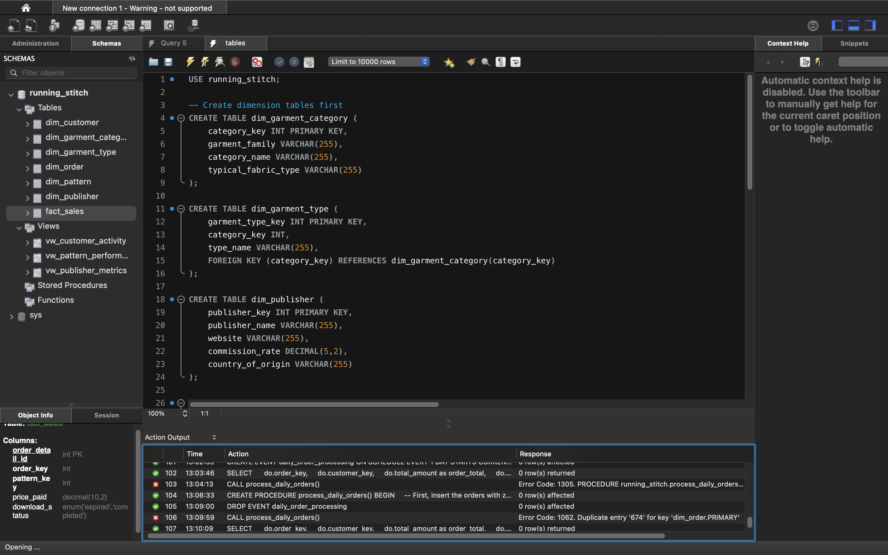

# Running Stitch: Sewing Pattern Database Project

## The Database

## Overview
For the CodeFirstGirls SQL course, I needed to demonstrate my ability to build and maintain a database. As a sewist, I devised a fake company that sells sewing patterns from a variety of pattern companies and wanted to use current data as the core. A well known sewing website is The FoldLine, selling patterns in the same way. The data was sourced from webscraping and generation, the process of which can be found [here](../scraper/README.md). Think of it as something similar to The FoldLine, but built from scratch as a learning exercise.

## Directory 
The database part of the project is stored in the following structure:
```
database/
├── README.md                                   # This file
├── final_presentation.key                      # Presentation
├── backup/
│   └── running_stitch_full_backup.sql # The backup
├── output_data/
│   ├── customer_activity_query.csv             # Data from customer query
│   ├── groupby_having_result.csv               # Data from GroupBy & Having query
│   ├── pattern_performance_query.csv           # Data from pattern query
│   ├── publisher_metric_query.csv              # Data from revenue per publisher
│   ├── storedfunction_pattern_revenue.csv      # Data from revenue per pattern
│   └── subquery_popularpatterns,csv            # Data from popular patterns subquery
├── queries/
│   └── *.sql                                   # All queries run are saved separately here
├── schema/
│   ├── foreign_keys.sql                        # Setting up foreign keys
│   ├── indexes.sql                             # Setting up indexes for better searching
│   ├── relationships.sql                       # Checking relationships
│   ├── tables.sql                              # Table creation
│   └── transform_tables.sql                    # Transforming tab;les
├── procedures/
│   └── storedprocedure_analyzecustomers.csv    # Data from analysing customers
├── screenshots/
│   └── *.png                                   # Images to demonstrate my working
└──  views/
    ├── vw_customer_activity.sql                # Customer Activity
    ├── vw_pattern_performance.sql              # Pattern Performance
    └── vw_publisher_metrics.sql                # Pattern-makers Metrics
```

## Database Schema
The database follows a snowflake schema architecture, which is an extension of the star schema, where dimension tables are normalised into multiple related tables. In this implementation, the `OrderDetails` table serves as the central fact table, with dimensional data organized in a hierarchical structure. I chose the Snowflake schema for these reasons:
- **Data Normalisation:** Snowflake reduces data redundancy by breaking down dimension tables into smaller, more specific tables. For example, instead of having all garment information in the Patterns table, it's separated into GarmentTypes and Publishers tables, eliminating repetitive data storage.
- **Referential Integrity:** The hierarchical structure ensures data consistency through well-defined relationships. Each Pattern must have a valid Publisher and GarmentType, maintaining data quality throughout the system.
- **Scalability:** The normalised structure makes it easier to add new dimensions or modify existing ones without affecting the core fact table. This is particularly important for a growing pattern database where new publishers or garment types might be added regularly.

Snowflake databases do have more tables that mean that queries have to use more joins, but due to the reduction of redundant data, they tend to be smaller in size than star databases. It's a common naming convention in data warehousing to prefix fact tables with `fact_` and dimension tables with `dim_`. This convention comes from dimensional modelling practices popularized by Ralph Kimball, one of the key pioneers of data warehouse design. Cool, huh?

> **Fun Fact #1 - Snowflake Space Savings**
> 
> I like to imagine that organizing I'm sewing patterns in physical folders, which for me is A4 envelopes in a box. In a regular system (like a star schema), I might write out "Simplicity Patterns" over and over in each pattern's folder. But in a snowflake schema, I just have one "Publishers" folder with "Simplicity Patterns" written once and all my patterns just have a small reference number pointing to it - like a library catalogue! That's a level of organisation, I'll never achieve with my personal sewing patterns, but this is why snowflake schemas save space - they avoid repeating long text strings by storing them just once and using small reference numbers everywhere else. They do mean more joins though!


### Fact Table
#### fact_sales
Central fact table recording pattern purchases with 21,267 records
- `order_detail_id` (PK): Unique identifier for each sale
- `order_key` (FK): Links to ```dim_order```
- `pattern_key` (FK): Links to ```dim_pattern```
- `price_paid`: Actual price paid for pattern
- `download_status`: Status of pattern download

### Dimension Tables
#### dim_garment_category
This table represents the highest level of pattern classification with 33 categories
- `category_key` (PK): Unique identifier for each category
- `garment_family`: Broad classification (e.g., "Womenswear", "Menswear", "Children's")
- `category_name`: Specific category name (e.g., "Dresses", "Pants", "Shirts")
- `typical_fabric_type`: Common fabric recommendations for this category

#### dim_garment_type
More specific classification of garments with 38 records, connected to ```categories```
- `garment_type_key` (PK): Unique identifier for each garment type
- `category_key` (FK): Links to ```dim_garment_category```
- `type_name`: Specific type (e.g., "A-line Dress", "Straight-leg Pants")

#### dim_publisher
Information about pattern publishers/companies with 48 records
- `publisher_key` (PK): Unique identifier for each publisher
- `publisher_name`: Name of the pattern company
- `website`: Publisher's website
- `commission_rate`: Standard commission rate for this publisher
- `country_of_origin`: Publisher's country

#### dim_pattern
Detailed pattern information with 150 records
- `pattern_key` (PK): Unique identifier for each pattern
- `publisher_key` (FK): Links to ```dim_publisher```
- `garment_type_key` (FK): Links to ```dim_garment_type```
- `pattern_name`: Name of the pattern
- `price`: Standard retail price
- `description`: Pattern description
- `suggested_fabrics`: Recommended fabric types
- `fabric_requirements`: Amount of fabric needed
- `sizing`: Available size range
- `notions`: Required additional materials
- `pattern_includes`: List of pattern pieces included

#### dim_customer
Customer information with 1000 records
- `customer_key` (PK): Unique identifier for each customer
- `first_name`: Customer's first name
- `last_name`: Customer's last name
- `email`: Contact email
- `date_joined`: Registration date
- `age_years`: Customer's age
- `country`: Customer's country

#### dim_order
Order header information with 3828 records
- `order_key` (PK): Unique identifier for each order
- `customer_key` (FK): Links to ```dim_customer```
- `order_date`: Date of order
- `total_amount`: Total order amount

### Key Relationships
1. Each fact_sales record:
   - Links to one pattern (dim_pattern)
   - Links to one order (dim_order)
   - Represents a single pattern purchase

2. Each pattern:
   - Has one publisher (dim_publisher)
   - Has one garment type (dim_garment_type)
   - Can appear in multiple sales

3. Each garment type:
   - Belongs to one category (dim_garment_category)
   - Can be used by multiple patterns

4. Each order:
   - Is placed by one customer (dim_customer)
   - Can contain multiple patterns (through fact_sales)

This structure allows for various analytical queries such as:
- Pattern sales by category/type
- Publisher performance analysis
- Customer purchasing patterns
- Sales trends over time
- Popular pattern types by region

> Fun Fact #2 - Normalised Data is Like Marie Kondo for Databases! 
>
> Normalised data is all about having "a place for everything and everything in its place." Instead of stuffing all information about a pattern into one messy table (like throwing everything in my one big wardrobe higgledy-piggledy), normalisation breaks it down into organised categories. It's organizing my sewing room/bedroom: patterns in one drawer, notions like zips and buttons in another and fabric in the plastic containers. Each piece of information lives in exactly one place, which means:
> - When I update something (like a publisher's address), I only need to change it in one spot
> - I'm less likely to have mismatched information
> - It's easier to find and manage specific types of data
> - I really need to normalise my physical sewing space rather than learn SQL...

## Setup
I'm going to be using MySQL to store this database for the project.



1. Create the database:
  ```sql
  -- Create database
  CREATE DATABASE IF NOT EXISTS running_stitch;
  USE sewing_patterns;
  ```

2. Create tables:
  ```sql
  USE running_stitch;

    -- Create dimension tables first
    CREATE TABLE dim_garment_category (
        category_key INT PRIMARY KEY,
        garment_family VARCHAR(255),
        category_name VARCHAR(255),
        typical_fabric_type VARCHAR(255)
    );

    CREATE TABLE dim_garment_type (
        garment_type_key INT PRIMARY KEY,
        category_key INT,
        type_name VARCHAR(255),
        FOREIGN KEY (category_key) REFERENCES dim_garment_category(category_key)
    );

    CREATE TABLE dim_publisher (
        publisher_key INT PRIMARY KEY,
        publisher_name VARCHAR(255),
        website VARCHAR(255),
        commission_rate DECIMAL(5,2),
        country_of_origin VARCHAR(255)
    );

    CREATE TABLE dim_pattern (
        pattern_key INT PRIMARY KEY,
        publisher_key INT,
        garment_type_key INT,
        pattern_name VARCHAR(255),
        price DECIMAL(10,2),
        description TEXT,
        suggested_fabrics TEXT,
        fabric_requirements TEXT,
        sizing VARCHAR(255),
        notions VARCHAR(255),
        pattern_includes TEXT,
        FOREIGN KEY (publisher_key) REFERENCES dim_publisher(publisher_key),
        FOREIGN KEY (garment_type_key) REFERENCES dim_garment_type(garment_type_key)
    );

    CREATE TABLE dim_customer (
        customer_key INT PRIMARY KEY,
        first_name VARCHAR(255),
        last_name VARCHAR(255),
        email VARCHAR(255),
        date_joined DATE,
        age_years INT,
        country VARCHAR(255)
    );

    CREATE TABLE dim_order (
        order_key INT PRIMARY KEY,
        customer_key INT,
        order_date DATE,
        total_amount DECIMAL(10,2),
        FOREIGN KEY (customer_key) REFERENCES dim_customer(customer_key)
    );

    CREATE TABLE fact_sales (
        order_detail_id INT PRIMARY KEY,
        order_key INT,
        pattern_key INT,
        price_paid DECIMAL(10,2),
        download_status ENUM('expired', 'completed'),
        FOREIGN KEY (order_key) REFERENCES dim_order(order_key),
        FOREIGN KEY (pattern_key) REFERENCES dim_pattern(pattern_key)
    );
```


The tables have to be loaded in the same order as they were created. Most of them are very long (maybe I went overboard on the generation) so I will use an import feature.

For the rest of the tables, I used the MySQL interface to import the remaining tables. Finally, I set the indexes:

```sql
-- Indexes for dimension tables
CREATE INDEX idx_dim_pattern_publisher ON dim_pattern(publisher_key);
CREATE INDEX idx_dim_pattern_garment ON dim_pattern(garment_type_key);
CREATE INDEX idx_dim_garment_type_category ON dim_garment_type(category_key);
CREATE INDEX idx_dim_order_customer ON dim_order(customer_key);

-- Indexes for fact table
CREATE INDEX idx_fact_sales_order ON fact_sales(order_key);
CREATE INDEX idx_fact_sales_pattern ON fact_sales(pattern_key);
```

The foreign keys were also set up, and checked using these query.


## Database Structure (EER) for MySQL Data
Now that the tables are imported and the relationships set, the EER looks like this:
[](https://mermaid.live/edit#pako:eNqFVcGS2yAM_RWG8-4P5NzpZS8701snM4wCsqPWgAtitl5n_704sZ3EkNSHxEg8eJKe5FFqb1Du5N6J_GD4RtAGsJdlA5pVhA6j-Dq9vp5OwpBVPTBjcGIn9pKc7pLBuJfPEDpF9hbDGdKnoI8Q0YjD8Bzmg5kxB-y8a6NgvyBuidxyS4eO4nG96rK6veoBsIVg0bHiocczVgNj6wN9ZjTEW_Td1soRM3KoMC-iHS-W6SHH4hyxMshAnSIj3t9q_t84iO8bzxxS4TOoyUIn-kAac-Bkrj50yQrjP1znwajIwClevF8L1WsZxkdMthyXYpdUcl6WCPNryZE9Q6fA-uS4wmOp2vg48i2XVQ7VnN0WstgQOZBr19MdWHyQ1auZ8S9nX9SBeibvNp6Y2hYjo1ENHDIybvwXqwr4J1HAiVos-ET6zH-F2fnpvu2BC_m1S8ukrq05Pqnie5mXhkLkTVZmVwePPGizrjeCmH7UL08OzT0DaFENCKHMgZ4EEoaaRNb2H58JoRLPdUOV-QceItU0q721FGNOvgp3or7nqnyT-4hachXWdwNl_I9Gi3abp80jAZ-B15iqF68Ta3xydiVpC74BS91Qxr7AqynNxEjnfp9VP_GcKcoXmZWXtWLyh-lMaS_5mBtiL6eRarCB1PE0T6etkNj_GJyWOw4JX2TwqT3KXQNdzKvUTwKbv2qrtQf30_tl_fUP0tBMtg)

## Features
### Views
When creating these views I tried to concentrate on the three elements of the business, which are the patterns, the customers and the publisher. A deeper analysis would look at the garment categories too.

#### 1. Pattern Performance View (vw_pattern_performance)
This first view acts as a comprehensive dashboard for individual pattern performance, combining information about sales, ratings and basic pattern details all in one place. It shows basic pattern information (name, publisher, type, category), sales metrics (number of orders, total revenue), customer satisfaction (average rating, number of reviews) and pricing information.


```sql
CREATE VIEW vw_pattern_performance AS
SELECT 
    p.pattern_id,
    p.pattern_name,
    pub.publisher_name,
    gt.type_name,
    p.price,
    COUNT(DISTINCT od.order_id) as total_orders,
    SUM(od.price_paid) as total_revenue,
    AVG(r.rating) as avg_rating,
    COUNT(DISTINCT r.rating_id) as review_count
FROM 
    patterns p
    LEFT JOIN publishers pub ON p.publisher_id = pub.publisher_id
    LEFT JOIN garment_types gt ON p.garment_type_id = gt.garment_type_id
    LEFT JOIN order_details od ON p.pattern_id = od.pattern_id
    LEFT JOIN ratings r ON p.pattern_id = r.pattern_id
GROUP BY 
    p.pattern_id, p.pattern_name, 
     pub.publisher_name, 
    gt.type_name, p.price
;
```

To get the most out of the view, I paired it with an example query that finds the top 10 bestselling patterns. It's me asking the database, "What are the star products?" The results show which patterns are making the most money and who publishes them and how customes rate them. This is important for understanding what sells well and why.

```SQL
SELECT 
    pattern_name, publisher_name,
    total_orders, total_revenue
FROM vw_pattern_performance
WHERE total_orders > 0
ORDER BY total_revenue DESC
LIMIT 10;
```


I saved the output data [here](./output_data/pattern_performance_query.csv) to show the outcome. It shows that Friday Pattern Company and Sew Liberated each have two patterns in the top 10, demonstrating consistent high performance and other publishers each have one pattern, suggesting a healthy competitive market. It is notable that indie pattern companies dominate this list rather than traditional "Big 4" pattern companies. 

Outerwear patterns have high revenue, with three jackets/coats (Hovea, Landgate, Ilford) in the top 10 with dresses bring strong performers (Wilder, Kielo, Hinterland). The range includes versatile patterns offering multiple variations (e.g., Pietra offers trousers and shorts, Olya includes shirt and dress options). There is a mix of difficulty levels represented, from beginner-friendly (Wilder Gown) to more complex (Olya Shirt).

#### 2. Customer Purchase History View (vw_customer_activity)
This view focuses on customers and their behaviour by helping understand purchasing patterns and customer engagement. It shows customer demographics (name, country), shopping behaviour (total orders, amount spent), engagement level (reviews written, average ratings given) and order data (last purchase date).

```SQL
CREATE OR REPLACE VIEW vw_customer_activity AS
SELECT 
    dc.customer_key,
    dc.first_name,
    dc.last_name,
    dc.country,
    COUNT(DISTINCT do.order_key) as total_orders,
    SUM(fs.price_paid) as total_spent,
    COUNT(DISTINCT fs.pattern_key) as unique_patterns_bought,
    MAX(do.order_date) as last_purchase_date
FROM 
    dim_customer dc
    LEFT JOIN dim_order do ON dc.customer_key = do.customer_key
    LEFT JOIN fact_sales fs ON do.order_key = fs.order_key
GROUP BY 
    dc.customer_key, dc.first_name, dc.last_name, dc.country;
```

Again, I used the view to create another sample query that looks at spending patterns by country. It's like having a global map of where my most valuable customers are located. The results help identify which countries have the most active sewing communities and where marketing efforts might be most effective.

```SQL
SELECT 
    country,
    COUNT(*) as customer_count,
    AVG(total_spent) as avg_customer_spend,
    AVG(total_orders) as avg_orders_per_customer
FROM vw_customer_activity
GROUP BY country
ORDER BY avg_customer_spend DESC;
```


I saved the output data [here](./output_data/customer_activity_query.csv) to show the outcome. Now, I randomly generated this data so it's going to be off-kilter. For example, 242 countries are represented in the data, which means my business pays no attention to trading laws or considerations of language. Panama leads with the highest average customer spend (£1,387.70) but has only one customer, suggesting it is an outlier rather than a trend and the top 5 countries by average spend (Panama, Madagascar, Malawi, Paraguay, Wallis and Futuna) all have very few customers (1-3 each), indicating these high averages might not be representative. Most of the high-spending countries have relatively low customer counts, suggesting early market penetration rather than established markets. Traditional sewing markets like USA (£327.77/customer), UK (£481.20/customer), and France (£206.82/customer) show moderate average spending but surprisingly low customer counts. The developed markets generally show lower average spend but more consistent order patterns compared to emerging markets. The average orders per customer ranges from 1 to 20 orders, with Panama and Madagascar showing the highest engagement with 20 and 18 orders per customer respectively. The most established markets average 2-7 orders per customer and his suggests opportunity for increasing repeat purchase rates in many markets.

#### 3. Publisher Performance Metrics View (vw_publisher_metrics)
Next, this view evaluates publisher performance with the aim of helping maintain good relationships with pattern creators. It shows publisher information (name, country), catalogue size (total patterns, garment types offered), sales performance (total sales, revenue), customer satisfaction (review count, average rating) and pricing strategy (average sale price).

```sql
CREATE OR REPLACE VIEW vw_publisher_metrics AS
SELECT 
    dpub.publisher_key,
    dpub.publisher_name,
    dpub.country_of_origin,
    COUNT(DISTINCT dp.pattern_key) as total_patterns,
    COUNT(DISTINCT fs.order_key) as total_sales,
    SUM(fs.price_paid) as total_revenue,
    AVG(fs.price_paid) as avg_sale_price,
    COUNT(DISTINCT dgt.garment_type_key) as garment_types_offered
FROM 
    dim_publisher dpub
    LEFT JOIN dim_pattern dp ON dpub.publisher_key = dp.publisher_key
    LEFT JOIN fact_sales fs ON dp.pattern_key = fs.pattern_key
    LEFT JOIN dim_garment_type dgt ON dp.garment_type_key = dgt.garment_type_key
GROUP BY 
    dpub.publisher_key, dpub.publisher_name, dpub.country_of_origin;

```
My sample query for this view ranks publishers, or pattern-makers, by their overall performance. It shows who is bringing the most value to the platform and helps to make decisions about publisher partnerships and identifying which publishers might need support or recognition.

```SQL
SELECT 
    publisher_name,
    total_patterns,
    total_sales,
    total_revenue
FROM vw_publisher_metrics
ORDER BY total_revenue DESC;
```


The output data is [here](./output_data/publisher_metric.csv) to show the outcome. Traditional pattern companies (Simplicity, McCalls, Butterick) show strong presence, with Simplicity leading in revenue (£19,292) while independent companies like Merchant and Mills (£18,755) and Friday Pattern Company (£16,870) are competing successfully with traditional brands. Some publishers achieve high revenue with fewer patterns (Friday Pattern Company: 8 patterns, £16,870) but the average revenue per pattern varies significantly (e.g., Megan Nielsen: £3,150 from single pattern vs Simplicity: ~£1,608 per pattern). Three publishers (Madalynne, Patrick Grant, Juliana Martejevs) show sales activity but zero revenue, because the sample of the data I scraped had their free patterns included. The most successful indies (Merchant and Mills, Friday Pattern Company) demonstrate that smaller catalogues can generate substantial revenue and mid-tier publishers (£3,000-7,000 revenue) typically have 2-4 patterns each, suggesting focussed, quality-over-quantity approach. This data suggests a market that supports both traditional large-catalogue publishers and focused independent designers, with quality and brand reputation potentially more important than catalogue size.


### Stored Function
This function is a handy tool I came up with that can be used repeatedly throughout the database. It takes a publisher_id as input and retrieves the publisher's commission rate from dim_publisher, calculates total revenue from all their pattern sales and returns their earnings based on their commission rate.

This function is really useful for Running Stitch because it directly supports publisher payments and financial reporting, handles commission calculations consistently and combines data from multiple tables (`fact_sales`, `dim_pattern`, `dim_publisher`). It can be used in financial reports, publisher dashboards and payment processing.

```sql
    DELIMITER //

    CREATE FUNCTION calculate_publisher_earnings(publisher_id INT) 
    RETURNS DECIMAL(10,2)
    DETERMINISTIC
    BEGIN
        DECLARE total_rev DECIMAL(10,2);
        DECLARE commission_rate DECIMAL(5,2);
        DECLARE earnings DECIMAL(10,2);
        
        -- Get the publisher's commission rate
        SELECT dp.commission_rate 
        INTO commission_rate
        FROM dim_publisher dp
        WHERE dp.publisher_key = publisher_id;
        
        -- Calculate total revenue from all pattern sales
        SELECT SUM(fs.price_paid)
        INTO total_rev
        FROM fact_sales fs
        JOIN dim_pattern dp ON fs.pattern_key = dp.pattern_key
        WHERE dp.publisher_key = publisher_id;
        
        -- Calculate earnings (commission from total revenue)
        SET earnings = IFNULL(total_rev * (commission_rate / 100), 0.00);
        
        RETURN earnings;
    END //

DELIMITER ;
```

The stored function can be used in multiple ways, including how to:
- List all publishers with sales
- Show their commission rate
- Display total revenue from pattern sales
- Calculate their earned commission
- Sort by highest earners first

```sql
-- Simple call for a single publisher
SELECT 
    publisher_name,
    commission_rate,
    calculate_publisher_earnings(publisher_key) as earnings
FROM dim_publisher
WHERE publisher_key = 1;
```

For the publisher with the id of 1, I can see that Merchant and Mills has a commission rate of 0.20 and earning of £37.51.

| publisher_name	 |  commission_rate	|   earnings (£)
| :--------------    |  ------:         |   -----:
| Merchant and Mills |   0.20	        |   37.51


### Subquery Example
Here, I am using subqueries to find patterns that perform better than average, which is crucial for Running Stitch because:
- Helps identify star performers in the pattern catalogue
- Provides insights for inventory and marketing decisions
- Allows for complex comparisons against aggregated data
- Useful for recommending popular patterns to customers

```sql
    SELECT 
        dp.pattern_name,
        pub.publisher_name,
        COUNT(*) as sales_count
    FROM fact_sales fs
    JOIN dim_pattern dp ON fs.pattern_key = dp.pattern_key
    JOIN dim_publisher pub ON dp.publisher_key = pub.publisher_key
    GROUP BY dp.pattern_key, dp.pattern_name, pub.publisher_name
    HAVING sales_count > (
        SELECT AVG(pattern_sales.sale_count)
        FROM (
            SELECT COUNT(*) as sale_count
            FROM fact_sales
            GROUP BY pattern_key
        ) pattern_sales
    )
    ORDER BY sales_count DESC;
```


The output for the query is stored [here](./output_data/subquery_popularpatterns.csv). There are 78 patterns that are identified as having above-average sales which represent the high-performing portion of Running Stitch's pattern catalogue. The data includes multiple publishers, showing a diverse high-performing catalogue. The presence of 78 above-average patterns suggests a relatively steep sales curve, indicating that there's a clear distinction between highly successful patterns and the rest of the catalogue. Having 78 patterns in this category would be considered healthy because it shows success isn't limited to just a handful of patterns.

The data helps to identify which patterns deserve prominent placement on the website and these patterns could be featured in marketing materials and promotions. They might be good candidates for bundle deals with less popular patterns to boost those sales and could inform decisions about which pattern types to stock more of.

### Stored Procedure
A stored procedure is like having detailed instructions that anyone can follow. This customer spending analysis procedure is valuable for Running Stitch because:
- Makes complex analysis accessible to non-technical team members
- Ensures consistent reporting across different time periods
- Helps track geographical market performance
- Supports data-driven marketing and expansion decisions
- Can be scheduled to run automatically for regular reporting.

This procedure generates a report of customer spending by country for a given date range.

```sql
    DELIMITER //
    CREATE PROCEDURE analyze_customer_spending(
        IN start_date DATE,
        IN end_date DATE
    )
    BEGIN
        SELECT 
            dc.country,
            COUNT(DISTINCT dc.customer_key) as customer_count,
            SUM(fs.price_paid) as total_spent,
            AVG(fs.price_paid) as avg_order_value
        FROM dim_customer dc
        JOIN dim_order do ON dc.customer_key = do.customer_key
        JOIN fact_sales fs ON do.order_key = fs.order_key
        WHERE do.order_date BETWEEN start_date AND end_date
        GROUP BY dc.country
        ORDER BY total_spent DESC;
    END //
    DELIMITER ;
```

I can call the stored procedure like this to get the sales data from last year.
```sql
CALL analyze_customer_spending('2024-01-01', '2024-12-31');
```


The output data is saved [here](./output_data/storedprocedure_analyzecustomers.csv). The randomness of the data strikes again! The database has customers across 221 countries, which shows a truly global reach. However, this unusually high number of countries might need data validation (as there are only about 195 countries globally...)

From this data, I could improve Runing Stitch as a business by focussing on markets with high average order values for immediate growth and investigate successful markets to replicate their success elsewhere. Apart from using actual data, if it were a real business I could consider combining smaller markets into regional groups.

In terms of the data, this is all generated rather than real, but pretending for the moment, I would im prove the data quality by validating country codes/names and standardizing country names in the database.

### Group By & Having Query
This analysis Identifies publishers with premium pricing strategies and helps understand market positioning. It supports my partnership decisions with publishers and helps identify high-value business relationships

```sql
-- This query finds publishers with high-value patterns (avg price > overall avg)
SELECT 
    pub.publisher_name,
    COUNT(dp.pattern_key) as pattern_count,
    AVG(dp.price) as avg_pattern_price,
    SUM(fs.price_paid) as total_revenue
FROM dim_publisher pub
JOIN dim_pattern dp ON pub.publisher_key = dp.publisher_key
JOIN fact_sales fs ON dp.pattern_key = fs.pattern_key
GROUP BY pub.publisher_key, pub.publisher_name
HAVING avg_pattern_price > (
    SELECT AVG(price)
    FROM dim_pattern
)
ORDER BY total_revenue DESC;
```


The data is stored [here](./output_data/groupby_having_result.csv). There are 31 publishers have above-average pattern prices, which represents a significant portion of the pattern catalogue and shows diverse pricing strategies in the market. Some publishers focus on a few, high-value patterns and others a lot of higher-priced patterns. This indicates multiple viable business models in the premium segment

The total revenue varies significantly among premium publishers and higher prices don't always correlate with higher total revenue, suggesting that price is just one factor in overall success.

## CodeFirstGirls Requirements
### Implemented Features
#### Essential
- [x] Multiple tables with PK and FK relationships
- [x] Views combining 3-4 tables + query to analyse the view
- [x] Stored function
- [x] Subqueries
- [x] Database diagram
- [x] Provide backup
#### Advanced (two if alone, all if in a group)
- [x] Stored procedure
- [ ] Trigger
- [ ] Event
- [x] Group by & Having query

## Data Management
### Backup
The final stage of the project is to provide a backup. To do so, I am using the following bash command:
```bash
mysqldump -u root -p running_stitch > running_stitch_full_backup.sql
```
It is saved [here](./backup/running_stitch_full_backup.sql)

---
Created as part of my 'Running Stitch' project for the CodeFirstGirls SQL course.